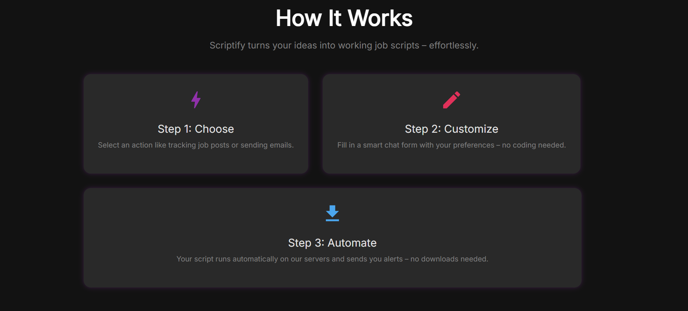
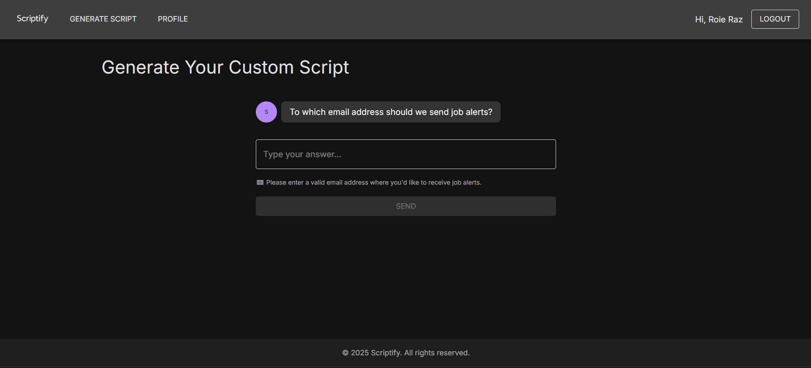
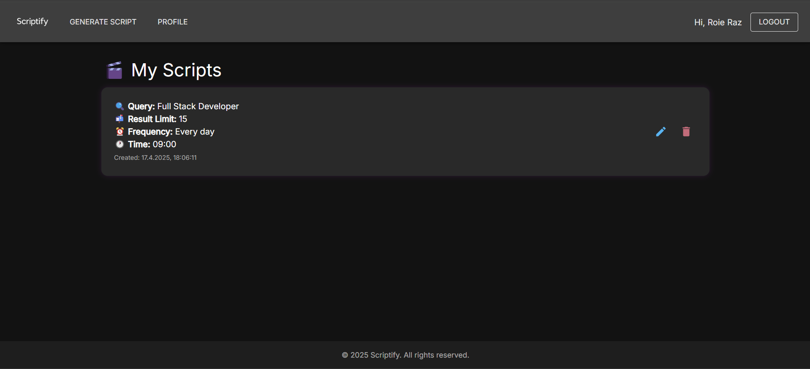

# 🚀 Scriptify

> Get notified about new job postings — automatically and effortlessly.

[](https://www.linkedin.com/in/roie-raz)
[](#)
[](#)
[](#)
[](#)

---

## 📌 What is Scriptify?

**Scriptify** is a smart assistant that helps you generate **automated job alert scripts** in Python – even if you don’t know how to code.

Just fill out a short form (in chat format), and Scriptify will:
- Search for job postings on trusted Israeli job sites like **Comeet**
- Send the results to your **email**
- Schedule the script to run **daily or weekly**

You don’t need to install anything. The script runs on our servers. ✅

---

## 🧭 How It Works

### 1. Landing Page


### 2. How It Works Section


### 3. Chat-Based Wizard


### 4. My Scripts Profile Page


---

## 💡 Features

- 🔍 **Targeted Job Search**  
  We search Google using smart filters like: `site:www.comeet.com/jobs your-keywords`

- 📬 **Email Notifications**  
  Results are automatically emailed using **SendGrid**

- 🧠 **AI-Powered Scripts**  
  Scriptify uses **Gemini AI** to generate Python scripts behind the scenes

- 🗓 **Scheduled Execution**  
  Scripts run daily or weekly at your preferred time via **Agenda.js**

- 👤 **Personal Profile**  
  Edit or delete scripts from your profile screen

---

## 🛠 Tech Stack

| Layer       | Tech                        |
|-------------|-----------------------------|
| Frontend    | React + TypeScript + MUI    |
| Backend     | Node.js + Express           |
| Scheduling  | Agenda.js + MongoDB         |
| Email       | Nodemailer + SendGrid       |
| AI          | Gemini (Google AI API)      |
| Job Search  | SerpAPI (Google Search API) |

---

## ✉️ Email Example

```
Here are the top 10 job listings for "Full Stack Developer":

1. Full Stack Developer – Comeet
https://www.comeet.com/jobs/abc123

2. Junior Developer – Join us!
https://www.comeet.com/jobs/xyz456

...

(Automated by Scriptify 🚀)
```

---

## 🔐 Security & Limitations

- Tokens stored via `HttpOnly` cookies
- User scripts run **only on our server** (not downloaded)
- Script queries are filtered to avoid irrelevant content (e.g. blogs/tutorials)

---

## 🧪 In Development

- ✅ Smart filtering for real job postings
- 🚧 In-app script analytics (coming soon)
- 🚧 Admin panel for monitoring
- ❌ No job application automation (by design)

---

## 🧭 Getting Started (Local Dev)

```bash
git clone https://github.com/your-username/scriptify.git
cd scriptify
npm install
npm run dev
```

Create a `.env` file with:

```
SERP_API_KEY=your_key
SENDGRID_API_KEY=your_key
GEMINI_API_KEY=your_key
JWT_ACCESS_SECRET=...
JWT_REFRESH_SECRET=...
MONGO_URI=...
```

---

## 🙌 Author

Made with 💜 by [Roie Raz](https://www.linkedin.com/in/roie-raz)